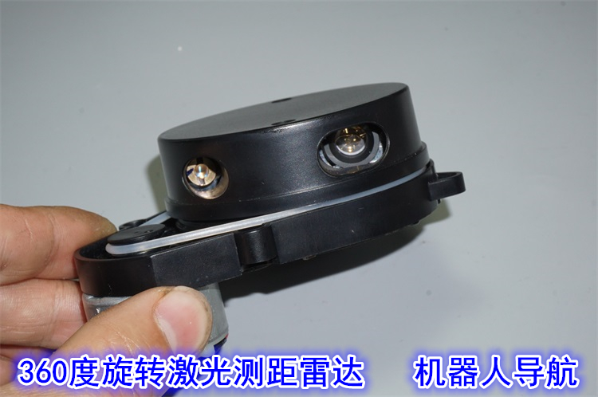
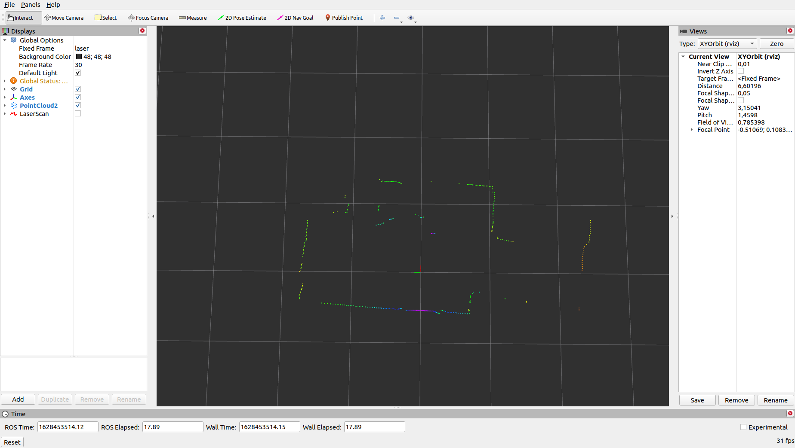

# MB_1r2t Driver
ROS1 driver for MB_1r2t


## How to install
I have currently only tested the driver with Ubuntu 20.04 using ROS1 Noetic

1. Install ros and create a workspace: http://wiki.ros.org/ROS/Tutorials/InstallingandConfiguringROSEnvironment

2. Clone and build package:

``` 
$ cd ~/catkin_ws/src
$ git clone https://github.com/Vidicon/mb_1r2t_ros.git
$ cd ~/catkin_ws/
$ catkin_make
```

## How to run the driver  
1. Connect the lidar using a TTL serial to usb adapter

2. Get access to the serial port  

To be able to use the serial port without root access you need to add the user to the dialout group:
```
$ sudo adduser $USER dialout
$ reboot
```
This only needs to be done once  

3. Find connected port:  
```
$ ls /dev/tty*
```
You would expect to see `/dev/ttyUSB0` or `/dev/ttyACM0` in the list

4. Launch the launch file:
```
$ roslaunch mb_1r2t_ros view.launch port:=/dev/ttyUSB0
```
You should see rviz with the lidar data:




